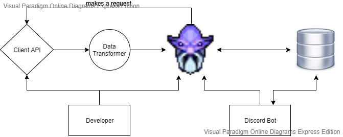

<a href="https://gamepedia.cursecdn.com/dota2_gamepedia/2/2b/Vo_dark_seer_dkseer_rare_01.mp3">" width="50" /></a>

&nbsp; "_If your enemy is equal, prepare for him. If greater, elude him. If weaker, **crush him**._"

 
 

